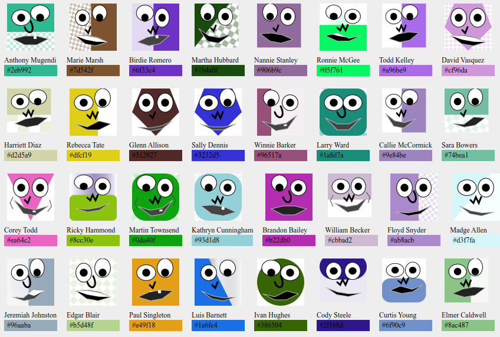

# Facitars!



Lightweight avatar generator for the browser and server (NodeJs) that creates colorful and gender neutral avatars and also conveniently returns the avatars primary color too!

**Facitars** was built after I tried dozens of others and couldn't find one that provided support for all of the following:

1. Creating lightweight (no complex curves and paths) SVG avatars with the help of [SVG.js](https://svgjs.dev/). The minified javascript file is only 17.8 KBs of awesomeness!

2. Generating and Returning a unique (seed generated) color for each avatar. This is useful for applications where you wish to color code certain parts of your UI based on a users ID/email or whatever your seed value may be.

3. Most importantly, this project is generates SVG avatars both in the browser and on the server in a consistent manner. To do so, it relies on [JSDOM](https://www.npmjs.com/package/jsdom) and [SVG.js](https://svgjs.dev/) while avoiding SVG operations that would produce inconsistent SVGs on browser and server. This means that [facitars](https://github.com/mugendi/facitars) goes beyond other avatar generators out there!

4. Finally, all avatars generated should be of the same size so as to fit well in grids and UIs

## Generating Facitars on the Browser

On the browser all you need is:

### 1. Load the js file

```html
<!-- Add this line preferably to your <head> -->
<script src="/dist/facitars.min.js"></script>
```

> Note that **Facitars** uses [SVG.js](https://svgjs.dev/). Consequently the minified svg.js file from [jsdelivr](https://cdn.jsdelivr.net/npm/@svgdotjs/svg.js@latest/dist/svg.min.js) will be automatically loaded if no instance of `window.SVG` is found.

> If svg.js has already been loaded prior to loading facitars, then that instance is used.

### 2. Initialize the class

```html
<script>
	// init
	const facitars = new Facitars();
</script>
```

### 3. Generate your Facitar

```html
<script>
	// Note generate() function is asynchronous
	(async () => {
		// create 300x300px facitar for the seed 'Anthony Mugendi'
		let { svg, color } = await facitars.generate('Anthony Mugendi', 300);
		// use the svg and color values returned as you desire
	})();
</script>
```

## Generating Facitars on the Server

### 1. Require Facitars

Of course start with installing **facitars** `yarn add facitars`

```javascript
// require
// Note you must call .node() for server rendering 
const Facitars = require('facitars').node();
```

> **Note:**
> You **must call `.node()`** when using on the server. This method wraps in JSDOM which is used to mock browser svg rendering.

> For the server version. A [local version](./src/lib/svg.min.js) of svg.js is included. This is because we cannot trust any scripts from jsdelivr or any other source as JSDOM is known to leak its sandbox.

### 2. Initialize the class

```javascript
// init
const facitars = new Facitars();
```

### 3. Generate your Facitar

```javascript
// Note generate() function is asynchronous
(async () => {
	// create 300x300px facitar for the seed 'Anthony Mugendi'
	let { svg, color } = await facitars.generate('Anthony Mugendi', 300);
	// use the svg and color values returned as you desire
})();
```

## Using Facitars with Webpack and other package managers

```javascript
// simply require facitars
// note we call .browser() for webpack
const Facitar = require('facitars').browser();

// proceed to use as desired
const facitar = new Facitar();
```

> **Note:**
> Ensure you call **`.browser()` not `.node()`** as JSDOM is not needed, nor would it work anyway, in a browser environment. Also `.browser()` provides only the facitar class and therefore is perfect for your tree-shaking.

> For Server renders, you can write the SVG data returned to an svg file for later serving via HTTP or any other use. See the [Node Example](./examples/node.js) folder for more.

For both browser and server examples above, the following Facitar is generated against the seed "Anthony Mugendi" 🙂


## API

`.generate(seed,size)`

The `seed` can be any value so long as it can be converted into a string using `seed.toString()`.

The `size` argument determines the dimensions of the final SVG. Default is 80.

## Examples

Have a look at [Browser Example](./examples/index.html) as well as the [NODE/Server](./examples/node.js) Examples for more.
